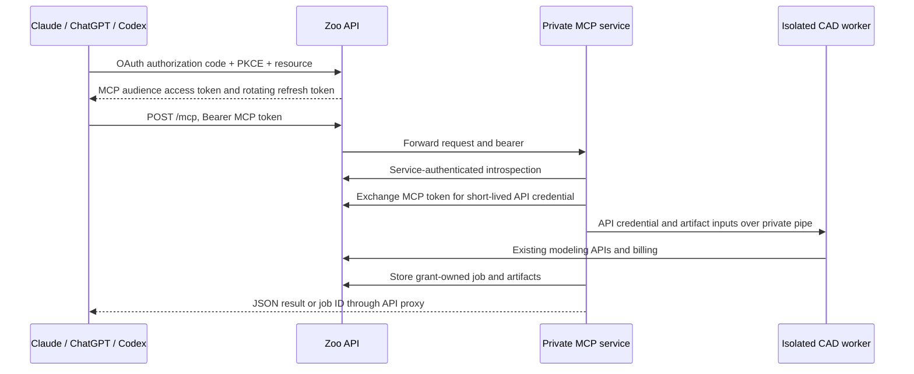

# Hosted Zoo MCP

The public URL is **https://api.zoo.dev/mcp**. The existing Rust API proxies
stateless JSON MCP requests to a private Python service. `GET /mcp` has no
subscription stream. Long CAD and project operations return a durable job ID;
clients poll `get_job` or call `cancel_job`. No SSE changes to Dropshot are needed.

The service uses MCP Python SDK v2.

## Deployment

Build `docker build --platform linux/amd64 -f Dockerfile.hosted -t IMAGE .`.
The current published KCL wheels require Linux x86-64. Use a Linux node with
Landlock ABI 3 or newer enabled and a seccomp profile permitting Landlock.
Workers refuse to start without confinement. Never enable
`ZOO_MCP_UNSAFE_LOCAL_DEV` in staging or production.

1. Apply the hosted MCP migration in the API repository using its migration workflow.
2. Provision a `zoo-mcp` Kubernetes Secret through the existing secret manager with
   independent random `ZOO_MCP_SERVICE_SECRET` and `ZOO_MCP_CAPABILITY_SECRET`
   values, at least 32 characters each. Give the API only the service secret.
3. Build and publish an immutable image through the existing image registry flow.
   Replace the example image tag in `deploy/hosted.yaml` with its digest.
4. Install the private deployment and service from `deploy/hosted.yaml` in the API
   namespace. Match the NetworkPolicy API selector to the existing workload's
   actual labels. Allow public HTTPS to Zoo and the approved attachment hosts;
   internal worker routing uses pod IPs on port 8080. The service has no ingress.
5. Set API variables from `deploy/api.env.example`, including
   `ZOO_MCP_UPSTREAM=http://zoo-mcp:8080`, and deploy the API proxy changes.
6. Add the **exact**, reviewed CIMD document URLs for the catalog clients to
   `ZOO_MCP_CLIENT_METADATA_URLS`. ChatGPT's stable document is
   `https://chatgpt.com/oauth/client.json`; Claude Code publishes
   `https://claude.ai/oauth/claude-code-client-metadata`. Obtain the current hosted
   Claude and Codex client URLs from the respective connection setup. Unknown
   metadata URLs are rejected. Existing registered Zoo public OAuth clients also
   work; use code + refresh grants and register exact callbacks.
7. Enable the existing ingress/WAF paths for `/mcp`, `/mcp/workspace`,
   `/mcp/files/*`, the OAuth endpoints and both discovery documents. Preserve
   bearer, Origin, MCP protocol, WWW-Authenticate, and content headers. Allow
   256 MiB file requests and a 330-second upstream timeout. Do not log headers,
   bodies, or query strings on these routes. The API logger strips URI queries;
   ingress/CDN logs need the same policy. Never cache authenticated responses.
8. Add an object lifecycle rule deleting `mcp/` objects after seven days in Zoo's
   private file bucket. This is a backstop for orphan objects after cascading
   account/grant deletion. Do not apply it to saved-project prefixes. The API's
   bounded sweep also deletes expired artifact metadata and blobs every 30 seconds.

For staging, use the API deployment's actual staging origin consistently for
`ZOO_API_URL`, `ZOO_API_AUDIENCE`, and `ZOO_MCP_RESOURCE=<origin>/mcp`.
`<origin>/mcp/workspace` is also accepted as the exact callback of the built-in
workspace OAuth app `8ee80fb5-b20c-49eb-97cc-0c218651a0a0`. The API derives its
OAuth issuer, discovery endpoints, login return URLs, and consent URLs from the
configured MCP resource origin; it never trusts the request Host header for this.

### API PR previews

Open the companion API PR and use `https://api-pr-<number>.dev.zoo.dev/mcp` in
ChatGPT's custom MCP connection. Use a Zoo dev account when the consent flow
opens. This runs against dev's database, file bucket, and modeling services.

The API repository's `kubernetes/preview` overlay deploys the private MCP service,
generates independent service/capability secrets for each PR, and configures
OAuth and file URLs from Argo's ingress hostname. It pins this repository's image
by commit SHA. The Hosted MCP workflow publishes that image after building and
exercising the worker sandbox; no package release or mutable image tag is needed.
When changing this PR, update the API overlay's image pin to the new published SHA.

Before starting the API, a preview schema job applies only the additive hosted
MCP migration with a separate migration history table. It does not advance dev's
normal release migration version. The migration is idempotent so the normal
release can subsequently apply it too. Preview removal does not roll back shared
schema or delete shared dev user data. File capabilities and OAuth tokens remain
bound to that preview's resource.

The preview ingress uses direct HTTPS (DNS-only in Cloudflare), permits 256 MiB
uploads, and disables URI access logs. Native attachment host allowlisting remains
opt-in; the workspace upload picker works without it. Linux AMD64 workers must
pass the Landlock readiness check; the preview never enables the unsafe local
development bypass.

## Authentication and ownership

Incoming access tokens are accepted only at the MCP audience. The public proxy
forwards them to the MCP service. Resource API calls use separate credentials
issued by `/mcp/delegate`, with a maximum lifetime of five minutes and the API
audience. Existing bearer middleware rejects MCP tokens on regular API routes.

Each consent grant binds user, client, resource, scopes and current organization.
Changing organization membership requires reconnecting. Revoking a grant blocks
introspection, delegated API access, lease renewal and file transfers. The API
supports PKCE S256, exact resource checks on authorization/code/refresh, rotating
refresh tokens, token-family revocation on reuse, and RFC 9207 issuer responses.
CIMD supports public-client negotiation through either the singular legacy field
or the plural supported-methods field. Client metadata is bounded, fetched
without redirects and restricted to exact operator-approved URLs.

The scope groups are `modeling`, `files:read`, `files:write`, `projects:read`,
`projects:write`, `projects:manage`, `datasets:read`, and existing `user:read`.
The consent page displays requested actions, API billing context, the verified client host, and callback host.
Users disconnect at `https://api.zoo.dev/oauth2/mcp/connections`.

## Files, projects, and recovery

- `create_upload` reserves metadata and returns a five-minute PUT capability.
  Upload exactly the declared byte count; then use the artifact ID. Upload claims
  are atomic and cannot overwrite an acknowledged file. A failed upload requires
  a new reservation. Download links are refreshed with `get_artifact` or `get_job`.
- Files are private to a grant. Transfers recheck grant revocation. The URL is a
  temporary bearer capability: give it only to the user/client that requested it.
- Limits: 256 MiB per file, 1,000 temporary artifacts / 10 GiB per grant, 1,000 files
  / 512 MiB expanded per project ZIP, four live scenes and eight concurrent jobs
  per grant. Database allocation transactions enforce shared quotas across pods.
- ZIP extraction rejects traversal, absolute and hidden paths, symlinks,
  encrypted members, case-insensitive duplicates and oversized expansion.
- `write_kcl_project` retains source and dependencies. `open_project` copies a
  current project archive. Create/update tools send complete archives to the
  existing project APIs. Updates require the revision acknowledged by the user
  and explicit `deleted_paths`; publication, sharing, transfer and deletion reuse
  Zoo's existing permissions and workflows.
- Workers have independent temporary directories and private pipes. They receive
  only delegated user credentials. Landlock permits their own directory and
  read-only runtime files, excluding other workers and service configuration.
- Job keys are scoped to a grant and retained for seven days. Identical retries
  return the same job; reuse with different arguments fails. Job/source/output
  records survive worker restart. A scene itself does not: explicitly restore it
  from source or a project. An interrupted or cancelled upstream operation may
  have incurred a charge or completed a mutation. Inspect the project before
  issuing a new operation key; never automatically replay it.
- Native ChatGPT attachment import is capability-detected. Configure exact
  `ZOO_MCP_FILE_HOSTS` entries from the host contract. Downloads pin a public DNS
  address with TLS hostname verification and reject redirects. The ordinary
  upload picker works in every supported host and in the browser fallback.

## Operations

The private `/_internal/metrics` route accepts the service header and exposes
worker/job gauges plus completed, failed, cancelled, unrecorded and cleanup-failed
outcome counters. Configure the existing metrics scraper with a private Secret
reference and a matching NetworkPolicy peer; this path has no public API proxy.
Alert on unrecorded outcomes, cleanup failures, worker saturation and elevated
HTTP failures. Never attach source, filenames, account IDs or tokens as labels.

## Rollout and recovery exercises

Use separate accounts and an organization in staging. Exercise each catalog
client's real OAuth flow, refresh, disconnect, reconnect and scope step-up.
Attempt cross-grant artifact/session/job access, revoked links, old refresh-token
reuse, expired downloads, archive traversal and quota races. Run one CAD export
with dependencies and confirm the expected billing entry. Restart a worker during
an operation, retrieve its job, restore the saved source and verify no replay.
Exercise project revision conflicts and intentional publish/share/transfer/delete.

The local browser harness uses synthetic data; its screenshots demonstrate UI
layout, not acceptance in a marketplace or a live billing/OAuth deployment.
Production rollout also requires the API migration, secret provisioning, approved
client metadata, ingress log policy and object lifecycle rule above. Roll back by
removing `ZOO_MCP_UPSTREAM` or routing the public proxy to the previous image;
leave the MCP schema in place while outstanding grants/jobs exist.
